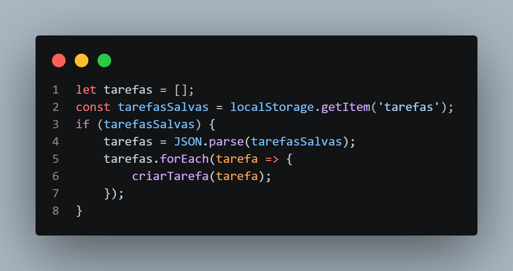
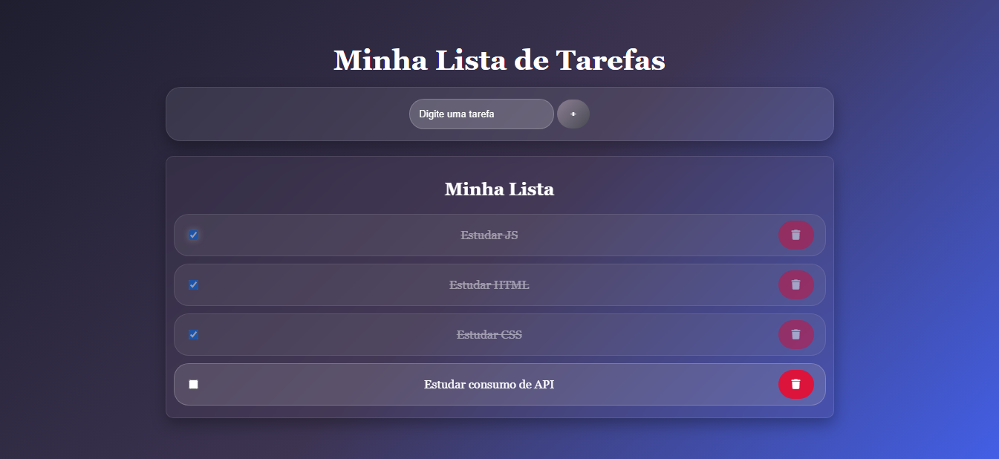

# ✅ To-Do List

Uma aplicação simples de lista de tarefas desenvolvida com **HTML, CSS e JavaScript**, criada com o objetivo de praticar manipulação do DOM, eventos, arrays e armazenamento de dados no navegador.

## 🚀 Funcionalidades

* Adicionar tarefas
* Marcar tarefas como concluídas
* Remover tarefas
* Mensagem quando a lista está vazia
* Salvamento automático com Local Storage
* Carregamento das tarefas ao atualizar a página
* Layout responsivo para dispositivos móveis

## 🛠️ Tecnologias Utilizadas

* HTML5
* CSS3
* JavaScript

## 📚 Conceitos Praticados

Durante o desenvolvimento deste projeto foram praticados conceitos como:

* Manipulação do DOM
* Eventos com addEventListener
* Criação dinâmica de elementos
* Arrays
* Funções
* Local Storage
* JSON.stringify()
* JSON.parse()
* Responsividade
* Organização de código

## 📷 Screenshot

## 🔗 Projeto Online

https://seu-link-aqui.vercel.app

## 🎯 Objetivo

Este projeto foi desenvolvido como parte dos meus estudos em desenvolvimento web, buscando praticar JavaScript na criação de uma aplicação interativa com persistência de dados.

---

Desenvolvido por Ezequiel Felin.
